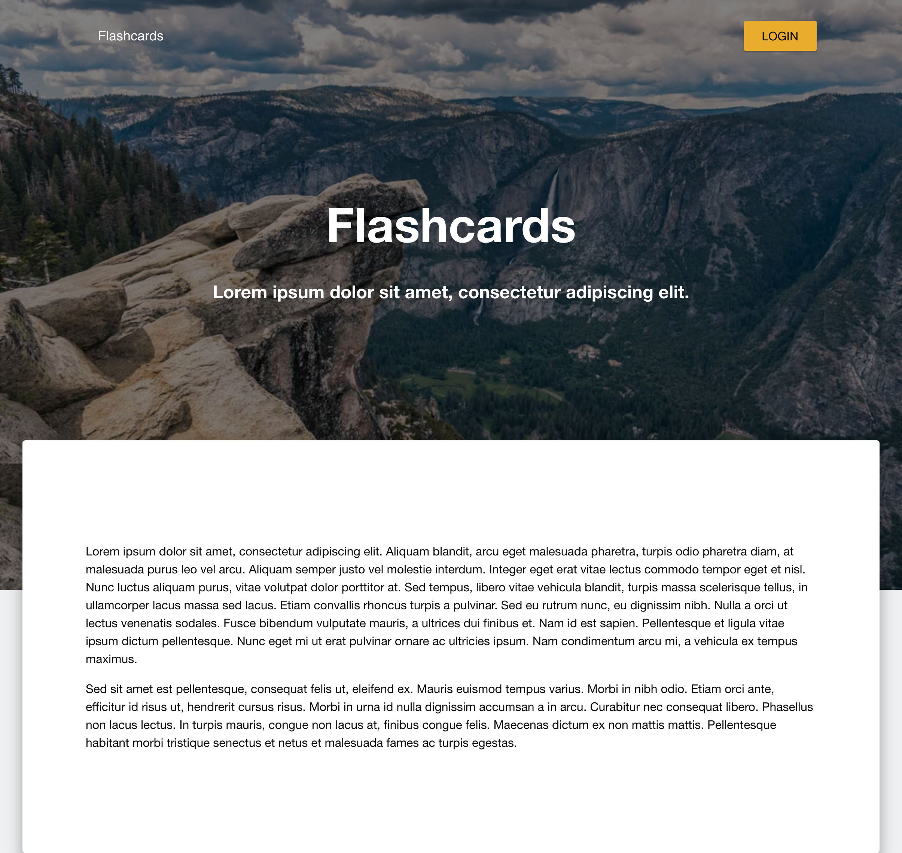

# Welcome to GraDecks

This app is intended for new teachers who can share their exam questions and get peers' feedback
It allows educators/instructors to be flexible on their curriculum and get enough time to edit test/review questions that are tailored to the appropriate class of education
The flashcard format is more manageable for users providing feedback

## Technologies Used
- Frontend:
    - HTML
    - CSS
    - Materialize-UI
    - React
- Backend:
    - Javascript
    - Node and Express Web Server
    - Mongo/Mongoose
    - Heroku for deploying the pages

## Website screenshots

 
    

## Website access
<a href="https://secure-bayou-78292.herokuapp.com/"><strong>Click here to explore GraDecks!</strong></a>

## Authors
* **Asha Mohamed** (https://github.com/asham28)
* **Ka Kun Wong** (https://github.com/Zashii)
* **Bryan Carvalho** (https://github.com/bryancarvalho)
* **Eunji Lee** (https://github.com/eunji120)
* **Amyn Merchant** (https://github.com/amynmerchant)